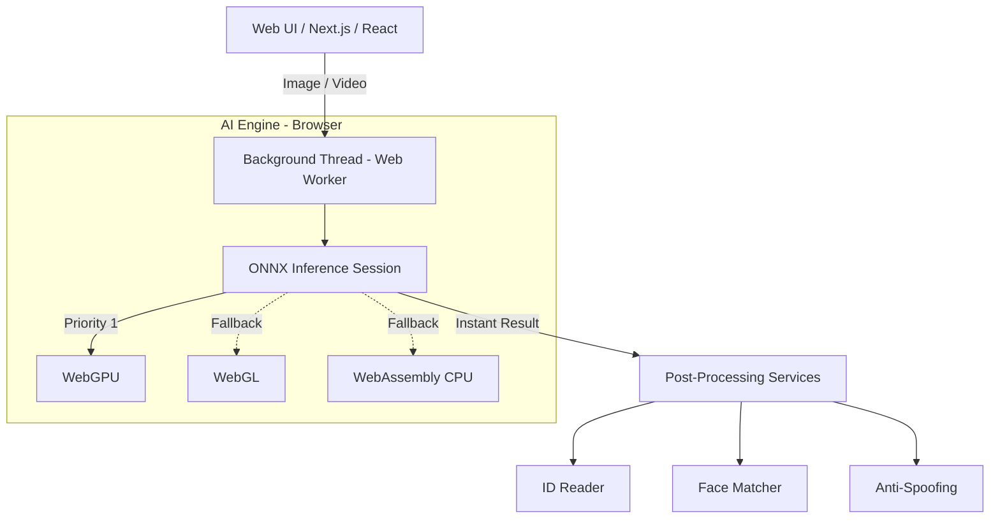

# NDieu eKYC - Edge AI Identity Verification

[](https://github.com/ndieu/kyc/actions)
[](https://badge.fury.io/js/@ndieu%2Fkyc-core)

*Đọc bản [Tiếng Việt (Vietnamese)](README.vi.md).*

## 🌟 Overview

**@ndieu/kyc** is an enterprise-grade open-source electronic Know Your Customer (eKYC) solution. Its breakthrough lies in its **Edge AI Computing Architecture** - meaning the entire facial recognition and document OCR process happens directly within the user's browser, rather than uploading sensitive images to a cloud server.

**Key Benefits:**
- **Privacy-by-Design:** ID cards and user selfies never leave the device, completely eliminating the risk of personal data leaks.
- **Zero Latency (0ms):** No waiting for network transmission; AI responds almost instantaneously.
- **Zero Server Costs:** Completely offloads heavy tensor computations from your backend to the client's device.
- **No UI Freezing:** Utilizes Inline Web Workers and WebGPU to run AI models in the background without affecting the user interface responsiveness.

## ⚙️ Core Modules

The library is structurally optimized with the following main modules:
- `@ndieu/kyc-core`: The environment-agnostic AI processing engine (OCR, data extraction, face matching, liveness detection).
- `@ndieu/kyc-browser`: Optimized specifically for the Web (Next.js, React, Vue, Vanilla JS). Integrates WebGPU and multi-threading capabilities.
- `@ndieu/kyc-node`: Module designed for backend Node.js environments (CommonJS & ESM).

## 🚀 Installation & Usage Guide

### 1. Install the Library

You need to install the packages matching your target environment:

**For Frontend (Browser, React, Next.js, Vue, Vanilla JS, etc.):**
```bash
npm install @ndieu/kyc-browser @ndieu/kyc-core
```

**For Backend (Node.js):**
```bash
npm install @ndieu/kyc-node @ndieu/kyc-core
```

### 2. Initialize and Download AI Models

The library requires `.onnx` AI model files to operate. Run the following command in your project root to auto-download the required models into your `public` directory (for Web apps):

```bash
npx @ndieu-kyc/cli init
npx @ndieu-kyc/cli download-models
```

### 3. Usage Example (For Browser)

Below is a code snippet demonstrating how to integrate the eKYC workflow into your Web application using Javascript/Typescript:

```typescript
import { DocumentExtractor, FaceMatcher, LivenessDetector, loadImage } from '@ndieu/kyc-browser';

async function runEKYC() {
  // 1. Initialize AI Engines
  // Provide the path to the models directory (downloaded in step 2)
  const docExtractor = new DocumentExtractor({ modelPath: '/models/document_extractor.onnx' });
  const faceMatcher = new FaceMatcher({ modelPath: '/models/face_matcher.onnx' });
  const livenessDetector = new LivenessDetector({ modelPath: '/models/liveness.onnx' });

  // 2. Load images from user input (File) or URLs
  const idImage = await loadImage(document.getElementById('id-card-input').files[0]);
  const selfieImage = await loadImage(document.getElementById('selfie-input').files[0]);

  // --- STEP A: READ AND EXTRACT INFO FROM ID CARD (OCR) ---
  console.log("Reading ID Card data...");
  const extractedData = await docExtractor.extract(idImage);
  console.log("Extraction Result:", extractedData);
  // Result includes: Full Name, DOB, ID Number, Address...

  // --- STEP B: PASSIVE LIVENESS DETECTION ---
  // Ensure the selfie is from a real, live person (anti-spoofing)
  console.log("Analyzing liveness...");
  const livenessResult = await livenessDetector.analyzePassive(selfieImage);
  if (!livenessResult.isLive) {
      alert("Spoofing attempt detected!");
      return;
  }

  // --- STEP C: FACE MATCHING ---
  console.log("Matching face on ID Card against Selfie...");
  const matchResult = await faceMatcher.match(idImage, selfieImage);
  
  if (matchResult.isMatch) {
      console.log(`Verification successful! Match confidence: ${matchResult.confidence}%`);
  } else {
      console.log(`Verification failed! Faces do not match.`);
  }
}

// Run the flow
runEKYC();
```

## 🏗️ Technology Architecture



The system features robust **Hardware Auto-Degradation**:
1. If the device/browser supports **WebGPU** (the fastest option), the engine will prioritize it.
2. If WebGPU is unavailable, it automatically falls back to **WebGL**.
3. Finally, without hardware acceleration, it gracefully uses **WebAssembly (WASM)** on the CPU.

All heavy tensor calculations are isolated in a separate thread (**Inline Web Worker**), guaranteeing that the web interface remains 60fps smooth without ever freezing.

## 🛡️ Continuous Integration (CI/CD)
The project utilizes automated CI pipelines via GitHub Actions, running Vitest tests on every PR. NPM packages are published completely automatically using **Semantic Release**.

---
*Developed by NDieu. Released under the MIT License.*
